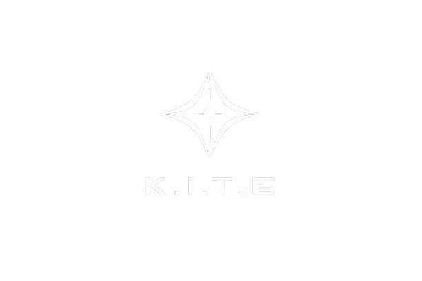

<p align="center">
  
</p>
<h1 align="center">K.I.T.E.</h1>
<h3 align="center">Kernel Integrated Task Engine</h3>

<p align="center">
  
  
  
  
</p>

<p align="center">
  <strong>A fully local, modular AI agent and voice assistant powered by Model Context Protocol skills.</strong>
</p>

<br />

## Overview

K.I.T.E. is an advanced conversational system designed to run entirely offline on your local machine. It combines the reasoning capabilities of local language models with a robust skill routing engine, allowing it to seamlessly answer questions or delegate complex tasks to structured scripts and API destinations.

By prioritizing privacy, performance, and flexibility, K.I.T.E. ensures your data never leaves your environment while granting you a powerful voice enabled assistant.

## Core Features

* **Local AI Execution**: Powered by Ollama, utilizing the `qwen2.5-coder:7b-instruct-q4_K_M` model for exceptional instruction following and code generation.
* **Semantic Skill Retrieval**: Employs Sentence Transformers and ChromaDB to instantaneously retrieve the most relevant logic based on user intent.
* **Intelligent Routing**: Automatically decides if a query can be answered inline or if a specialized capability is required.
* **Dynamic Execution**: Capable of executing local Python capabilities or forwarding requests to external servers.
* **Voice Integration**: Built in Text to Speech generation via Kokoro and SoundDevice for fluid, natural spoken responses.

## Architecture Highlights

1. **Registry and Retrieval**: New capabilities are defined in a simple JSON registry. On startup, K.I.T.E. embeds these definitions into a highly optimized vector store.
2. **Conversation Loop**: The entrypoint continuously accepts user input, routes decisions, and synthesizes speech in an event driven loop.
3. **Execution Engine**: When a tool is invoked, the executor safely processes the request and returns a raw result, which is then summarized naturally for audio output.

## Installation

Begin by cloning the repository and setting up your local environment.

```bash
git clone https://github.com/yourusername/kite.git
cd KITE_v3
python -m venv venv
source venv/bin/activate
pip install -r requirements.txt
```

Ensure you have Ollama installed globally and have pulled the required model.

```bash
ollama pull qwen2.5-coder:7b-instruct-q4_K_M
```

## Usage

Start the main conversational loop to bring K.I.T.E. online.

```bash
python main.py
```

The system will initialize its ChromaDB index, load the available capabilities, and greet you via its TTS engine. Simply type your query at the command prompt to interact.

## Configuration

All local capabilities and endpoints are registered in `registry/skills.json`. You can easily extend K.I.T.E. by adding new entries to this file and implementing the corresponding logic in the `skills` directory. Environment variables for advanced configuration can be placed in a `.env` file at the project root.
